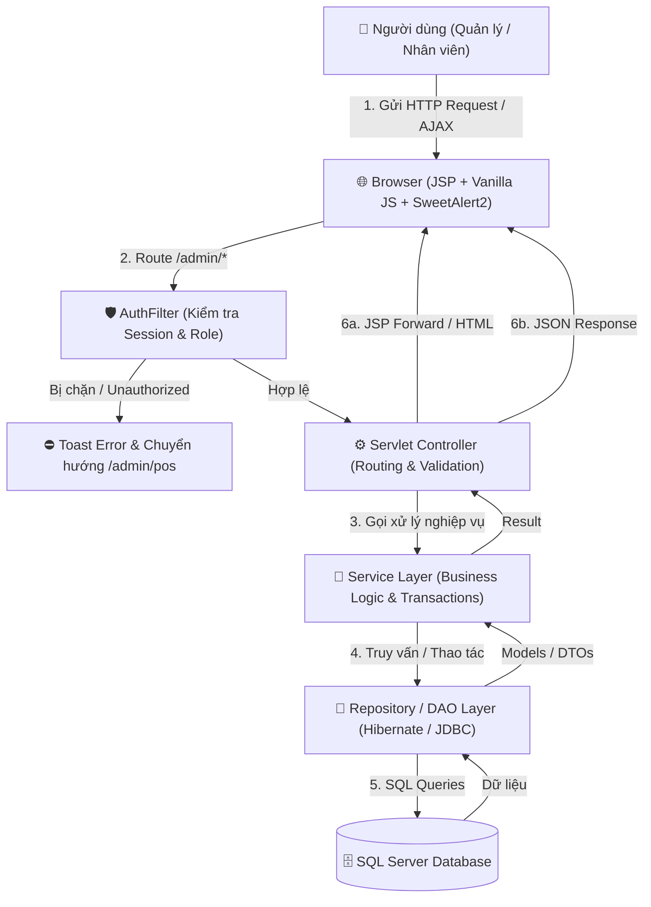

# Tài Liệu Tổng Quan & Chỉ Mục Luồng Hoạt Động Hệ Thống FamiCoats

Chào mừng bạn đến với bộ tài liệu mô tả luồng hoạt động (Workflows & Sequence Diagrams) của hệ thống **FamiCoats (Project1-SD21301)**. 

Tài liệu này được biên soạn nhằm giải thích chi tiết cơ chế vận hành từ giao diện người dùng (JSP/JavaScript), qua bộ lọc an ninh (`AuthFilter`), các Controller (Jakarta Servlet), tầng xử lý nghiệp vụ (Services / Repositories) cho tới cơ sở dữ liệu Microsoft SQL Server.

---

## 🏗️ Kiến Trúc Hệ Thống & Mô Hình Luồng Dữ Liệu

Hệ thống được phát triển theo mô hình **MVC (Model-View-Controller)** truyền thống kết hợp với các kỹ thuật xử lý bất đồng bộ (AJAX/Fetch API) cho trải nghiệm POS mượt mà:

---

## 📍 Bản Đồ Điều Hướng Route (Routing Map)

| Module | URL Pattern | Chức Năng Cốt Lõi | Quyền Hạn Hợp Lệ |
| :--- | :--- | :--- | :--- |
| **Xác thực & Phân quyền** | `/login`, `/google-login`, `/logout` | Đăng nhập/Đăng xuất, Quản lý Session | Tất cả người dùng |
| **Bán hàng POS** | `/admin/pos`, `/admin/pos/checkout`, `/admin/pos/draft/*` | Xử lý bán hàng tại quầy, mã VietQR, in hóa đơn | Quản lý & Nhân viên |
| **Sản phẩm & Biến thể** | `/admin/products/*`, `/admin/variants/*` | Quản lý sản phẩm, ma trận biến thể, Cloudinary API | Chỉ Quản lý (Nhân viên xem read-only) |
| **Hóa đơn & Đơn hàng** | `/admin/invoices/*` | Tra cứu, cập nhật trạng thái đơn hàng, xuất Excel | Quản lý & Nhân viên |
| **Khách hàng** | `/admin/customers/*`, `/api/provinces/*` | CRUD khách hàng, tra cứu địa chính Việt Nam | Quản lý (Nhân viên xem read-only) |
| **Nhân viên & Tài khoản**| `/admin/employees/*` | Quản lý tài khoản, mã hóa BCrypt, phân quyền | Chỉ Quản lý |
| **Mã giảm giá / Coupon** | `/admin/coupons/*` | Tạo coupon, điều kiện áp dụng, hạn mức sử dụng | Chỉ Quản lý (Nhân viên áp dụng tại POS) |
| **Bảng điều khiển** | `/admin/dashboard`, `/admin/home` | Thống kê doanh thu, biểu đồ, top sản phẩm | Chỉ Quản lý |

---

## 📚 Danh Mục Tài Liệu Luồng Hoạt Động Chi Tiết

Dưới đây là danh sách các tài liệu `.md` mô tả chi tiết quy trình, sơ đồ trình tự Mermaid, logic xử lý DB và edge cases cho từng module:

1. 🔐 **[Luồng Xác Thực & Phân Quyền Bảo Mặt](file:///d:/DuAn1-ChayThu/Project1-SD21301/docs/luong_hoat_dong/luong_auth_security.md)**
   - *File:* [docs/luong_hoat_dong/luong_auth_security.md](file:///d:/DuAn1-ChayThu/Project1-SD21301/docs/luong_hoat_dong/luong_auth_security.md)
   - *Nội dung:* Luồng Đăng nhập (Form, Google OAuth2, Dev Auto-login), AuthFilter kiểm tra Session, phân quyền Quản lý vs Nhân viên, chuyển hướng bảo vệ route.

2. 🛍️ **[Luồng Bán Hàng Tại Quầy (POS)](file:///d:/DuAn1-ChayThu/Project1-SD21301/docs/luong_hoat_dong/luong_pos_ban_hang.md)**
   - *File:* [docs/luong_hoat_dong/luong_pos_ban_hang.md](file:///d:/DuAn1-ChayThu/Project1-SD21301/docs/luong_hoat_dong/luong_pos_ban_hang.md)
   - *Nội dung:* Xử lý đa giỏ hàng (tối đa 10 hóa đơn chờ), tra cứu biến thể, áp dụng Coupon, sinh mã VietQR động, Giao dịch SQL Transaction (tạo hóa đơn, trừ tồn kho `product_variants`, trừ coupon) và in hóa đơn.

3. 📦 **[Luồng Quản Lý Sản Phẩm & Biến Thể](file:///d:/DuAn1-ChayThu/Project1-SD21301/docs/luong_hoat_dong/luong_quan_ly_san_pham.md)**
   - *File:* [docs/luong_hoat_dong/luong_quan_ly_san_pham.md](file:///d:/DuAn1-ChayThu/Project1-SD21301/docs/luong_hoat_dong/luong_quan_ly_san_pham.md)
   - *Nội dung:* Tạo sản phẩm kèm các thuộc tính (Màu sắc, Kích cỡ, Chất liệu, Thương hiệu), sinh ma trận biến thể, tích hợp Cloudinary API lưu trữ ảnh, công tắc Toggle trạng thái.

4. 🧾 **[Luồng Quản Lý Hóa Đơn & Đơn Hàng](file:///d:/DuAn1-ChayThu/Project1-SD21301/docs/luong_hoat_dong/luong_quan_ly_hoa_don.md)**
   - *File:* [docs/luong_hoat_dong/luong_quan_ly_hoa_don.md](file:///d:/DuAn1-ChayThu/Project1-SD21301/docs/luong_hoat_dong/luong_quan_ly_hoa_don.md)
   - *Nội dung:* Bộ lọc đa chỉ tiêu (Mã, Trạng thái, Khoảng ngày), vòng đời trạng thái đơn hàng (Chờ xác nhận -> Đã xác nhận -> Đang giao -> Hoàn thành / Hủy), hoàn trả tồn kho khi hủy đơn, xuất Excel Apache POI.

5. 👥 **[Luồng Quản Lý Khách Hàng & Địa Chính](file:///d:/DuAn1-ChayThu/Project1-SD21301/docs/luong_hoat_dong/luong_quan_ly_khach_hang.md)**
   - *File:* [docs/luong_hoat_dong/luong_quan_ly_khach_hang.md](file:///d:/DuAn1-ChayThu/Project1-SD21301/docs/luong_hoat_dong/luong_quan_ly_khach_hang.md)
   - *Nội dung:* Quản lý thông tin khách hàng, tích hợp API Đơn vị hành chính Việt Nam (Tỉnh/Thành -> Quận/Huyện -> Phường/Xã), theo dõi lịch sử tích điểm và hóa đơn đã mua.

6. 👔 **[Luồng Quản Lý Nhân Viên & Tài Khoản](file:///d:/DuAn1-ChayThu/Project1-SD21301/docs/luong_hoat_dong/luong_quan_ly_nhan_vien.md)**
   - *File:* [docs/luong_hoat_dong/luong_quan_ly_nhan_vien.md](file:///d:/DuAn1-ChayThu/Project1-SD21301/docs/luong_hoat_dong/luong_quan_ly_nhan_vien.md)
   - *Nội dung:* Cấp tài khoản nhân viên, mã hóa BCrypt, gán quyền Quản lý (ID 1) hoặc Nhân viên (ID 2), vô hiệu hóa/kích hoạt tài khoản.

7. 🎁 **[Luồng Quản Lý Mã Giảm Giá (Coupon)](file:///d:/DuAn1-ChayThu/Project1-SD21301/docs/luong_hoat_dong/luong_quan_ly_khuyen_mai.md)**
   - *File:* [docs/luong_hoat_dong/luong_quan_ly_khuyen_mai.md](file:///d:/DuAn1-ChayThu/Project1-SD21301/docs/luong_hoat_dong/luong_quan_ly_khuyen_mai.md)
   - *Nội dung:* Tạo phiếu giảm giá (% hoặc tiền cố định), điều kiện giá trị đơn hàng tối thiểu, giới hạn lượt dùng toàn hệ thống & từng khách hàng, tự động đóng coupon hết hạn.

8. 📊 **[Luồng Bảng Điều Khiển & Thống Kê (Dashboard)](file:///d:/DuAn1-ChayThu/Project1-SD21301/docs/luong_hoat_dong/luong_thong_ke_dashboard.md)**
   - *File:* [docs/luong_hoat_dong/luong_thong_ke_dashboard.md](file:///d:/DuAn1-ChayThu/Project1-SD21301/docs/luong_hoat_dong/luong_thong_ke_dashboard.md)
   - *Nội dung:* Tổng hợp chỉ số doanh thu (hôm nay, tháng, năm), biểu đồ đơn hàng, danh sách top sản phẩm bán chạy, cảnh báo hàng tồn kho thấp.

---

## 🛠️ Hướng Dẫn Đọc & Sử Dụng

- Mỗi file tài liệu chứa sơ đồ **Mermaid Diagram**, bạn có thể xem trực tiếp dưới dạng hình vẽ trực quan trên GitHub, VS Code hoặc các Markdown Viewer có hỗ trợ Mermaid rendering.
- Các liên kết file trong tài liệu trỏ thẳng tới mã nguồn Java/JSP của dự án giúp lập trình viên dễ dàng tra cứu code thực tế khi bảo trì hoặc mở rộng tính năng.
