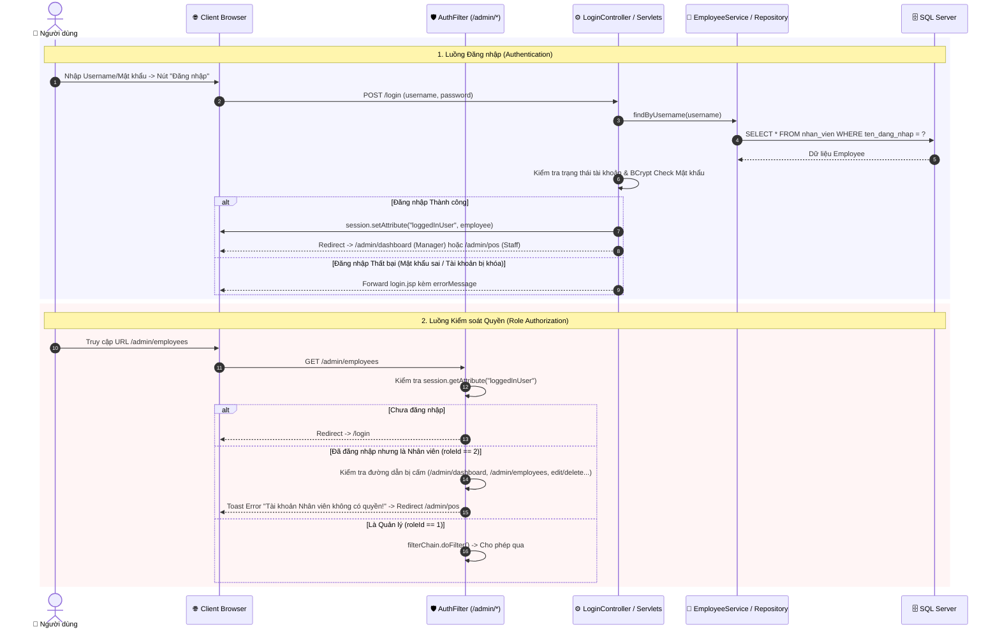

# 🔐 Luồng Hoạt Động: Module Xác Thực & Phân Quyền Bảo Mặt (Auth & Security)

Tài liệu này mô tả chi tiết cơ chế đăng nhập, quản lý phiên làm việc (Session) và bộ lọc phân quyền hai lớp (UI level & AuthFilter level) trong hệ thống FamiCoats.

---

## 1. Thành Phần Code Đảm Nhận

- **View (JSP):**
  - [login.jsp](file:///d:/DuAn1-ChayThu/Project1-SD21301/src/main/webapp/WEB-INF/views/admin/login.jsp) - Màn hình đăng nhập chính.
- **Controllers / Servlets:**
  - [LoginController.java](file:///d:/DuAn1-ChayThu/Project1-SD21301/src/main/java/project/duan1_sd21301/controller/admin/LoginController.java) (`/login`) - Xử lý đăng nhập bằng Username / Mật khẩu.
  - [GoogleLoginController.java](file:///d:/DuAn1-ChayThu/Project1-SD21301/src/main/java/project/duan1_sd21301/controller/admin/GoogleLoginController.java) (`/login/google`) - Đăng nhập nhanh qua Google OAuth2.
  - [DevLoginController.java](file:///d:/DuAn1-ChayThu/Project1-SD21301/src/main/java/project/duan1_sd21301/controller/admin/DevLoginController.java) (`/dev-login`) - Đăng nhập nhanh môi trường Development.
  - [LogoutController.java](file:///d:/DuAn1-ChayThu/Project1-SD21301/src/main/java/project/duan1_sd21301/controller/admin/LogoutController.java) (`/logout`) - Hủy phiên làm việc Session.
- **Filter (Bảo mật Server-side):**
  - [AuthFilter.java](file:///d:/DuAn1-ChayThu/Project1-SD21301/src/main/java/project/duan1_sd21301/filter/AuthFilter.java) (`/admin/*`) - Chặn request chưa đăng nhập hoặc không đủ quyền.
- **Models:**
  - [Employee.java](file:///d:/DuAn1-ChayThu/Project1-SD21301/src/main/java/project/duan1_sd21301/model/huy/Employee.java) - Thông tin nhân viên và vai trò (`roleId`: 1 = Quản lý, 2 = Nhân viên).

---

## 2. Sơ Đồ Luồng Hoạt Động (Mermaid Sequence Diagram)

---

## 3. Các Bước Xử Lý Nghiệp Vụ Chi Tiết

### Bước 1: Tiếp nhận và Xác thực Đăng nhập
1. Khi truy cập `/login`, `LoginController.doGet()` trả về giao diện `login.jsp`.
2. Khi Submit form, `LoginController.doPost()` nhận `username` và `password`.
3. Kiểm tra tính hợp lệ dữ liệu cơ bản (không để trống).
4. Tìm kiếm tài khoản trong DB theo `ten_dang_nhap` hoặc `email`.
5. Tài khoản phải có trạng thái kích hoạt (`trang_thai = 1`). Mật khẩu được đối chiếu qua mã hóa BCrypt.
6. Lưu đối tượng `Employee` vào Session: `session.setAttribute("loggedInUser", employee)`.

### Bước 2: Phân luồng trang chủ sau Đăng nhập
- Nếu `employee.getRoleId() == 1` (Quản lý): Chuyển hướng tới Bảng điều khiển `/admin/dashboard`.
- Nếu `employee.getRoleId() == 2` (Nhân viên): Chuyển hướng thẳng tới Màn hình bán hàng `/admin/pos`.

### Bước 3: Đăng nhập Google OAuth2 & Dev Login
- `/login/google`: Nhận `code` từ Google Auth Server -> Lấy `email` -> Áp dụng tài khoản tương ứng trong hệ thống.
- `/dev-login`: Dành riêng cho thử nghiệm nhanh trong quá trình phát triển (chọn nhanh quyền Manager hoặc Staff).

### Bước 4: Kiểm soát Quyền hạn tại `AuthFilter`
Mọi HTTP Request có prefix `/admin/*` đều bắt buộc chạy qua `AuthFilter`:
1. Nếu chưa có Session hoặc `loggedInUser == null`: Chuyển hướng ngay về `/login`.
2. Nếu đối tượng là **Nhân viên (`roleId == 2`)**, Filter sẽ chủ động ngăn chặn các URL sau:
   - 🚫 `/admin/dashboard` (Thống kê doanh thu)
   - 🚫 `/admin/employees` (Quản lý tài khoản)
   - 🚫 `/admin/products/create`, `/edit`, `/delete`, `/toggle` (Thao tác sản phẩm)
   - 🚫 `/admin/variants/create`, `/edit`, `/delete` (Thao tác biến thể)
   - 🚫 `/admin/settings`, `/admin/accounts` (Cấu hình)
   - 🚫 `/admin/customers/edit`, `/delete` (Sửa/Xóa khách hàng)
3. Khi vi phạm quyền: Lưu `toastMessage = "Tài khoản Nhân viên không có quyền truy cập..."` và redirect về `/admin/pos`.

---

## 4. Xử Lý Ngoại Lệ & Edge Cases

- **Session Timeout (Phiên hết hạn):** Nếu người dùng ngưng thao tác quá thời gian cấu hình session, `AuthFilter` tự động phát hiện `loggedInUser == null` và đẩy về trang đăng nhập.
- **Tài khoản bị Quản lý khóa khi đang đăng nhập:** Ở lượt request tiếp theo, `AuthFilter` hoặc Servlet kiểm tra lại thông tin, nếu bị vô hiệu hóa sẽ hủy Session và thông báo tài khoản đã bị khóa.
