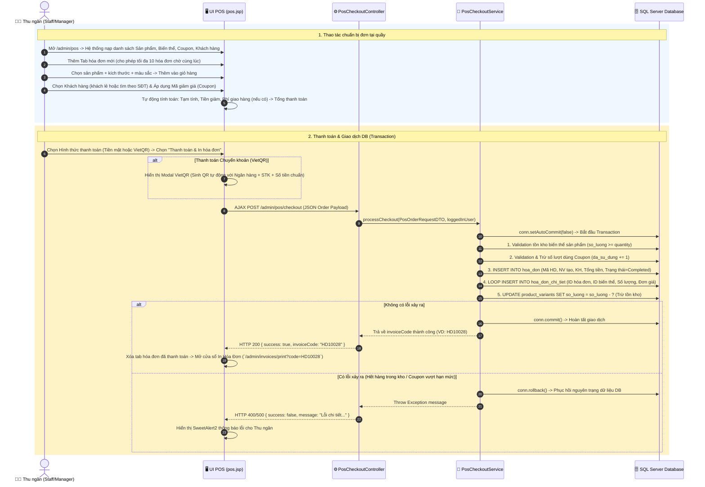

# 🛍️ Luồng Hoạt Động: Module Bán Hàng Tại Quầy (POS - Point of Sale)

Tài liệu này mô tả chi tiết luồng bán hàng tốc độ cao tại quầy, quản lý đơn hàng chờ đa tab, áp dụng mã giảm giá, sinh mã VietQR chuyển khoản tự động, quy trình giao dịch SQL Transaction an toàn và in hóa đơn cho khách.

---

## 1. Thành Phần Code Đảm Nhận

- **View (JSP & JS):**
  - [pos.jsp](file:///d:/DuAn1-ChayThu/Project1-SD21301/src/main/webapp/WEB-INF/views/admin/pos.jsp) - Màn hình thu ngân POS tích hợp modal tìm sản phẩm, chọn khách hàng, chọn coupon và quét VietQR.
  - [invoice-print.jsp](file:///d:/DuAn1-ChayThu/Project1-SD21301/src/main/webapp/WEB-INF/views/admin/phuc/invoice-print.jsp) - Giao diện in hóa đơn bán hàng.
- **Controllers / Servlets:**
  - [PosController.java](file:///d:/DuAn1-ChayThu/Project1-SD21301/src/main/java/project/duan1_sd21301/controller/admin/PosController.java) (`/admin/pos`) - Tải dữ liệu ban đầu (danh sách sản phẩm, biến thể, khách hàng, coupon kích hoạt).
  - [PosCheckoutController.java](file:///d:/DuAn1-ChayThu/Project1-SD21301/src/main/java/project/duan1_sd21301/controller/admin/PosCheckoutController.java) (`/admin/pos/checkout`) - Xử lý thanh toán đơn hàng (AJAX POST JSON).
  - [PosDraftController.java](file:///d:/DuAn1-ChayThu/Project1-SD21301/src/main/java/project/duan1_sd21301/controller/admin/PosDraftController.java) (`/admin/pos/draft/*`) - Quản lý và lưu trữ các đơn hàng chờ.
- **Services & Repositories:**
  - [PosCheckoutService.java](file:///d:/DuAn1-ChayThu/Project1-SD21301/src/main/java/project/duan1_sd21301/service/pos/PosCheckoutService.java) - Chịu trách nhiệm thực thi **SQL Transaction** an toàn (tạo/cập nhật hóa đơn, thêm chi tiết hóa đơn, trừ tồn kho `so_luong` của biến thể, cập nhật `da_su_dung` mã giảm giá).
- **DTOs:**
  - `PosOrderRequestDTO.java`, `PosOrderItemDTO.java` - Đối tượng truyền nhận dữ liệu hóa đơn POS.

---

## 2. Sơ Đồ Luồng Hoạt Động (Mermaid Sequence Diagram)

---

## 3. Các Bước Xử Lý Nghiệp Vụ Chi Tiết

### 3.1. Quản lý Đa Đơn Hàng Chờ (Multi-tab Orders)
- Màn hình POS cho phép thu ngân phục vụ song song nhiều khách hàng cùng lúc.
- Mỗi đơn hàng được lưu dưới dạng một **Tab tạm (Draft Order)** trong LocalStorage / Memory.
- Hỗ trợ tới 10 hóa đơn chờ. Thu ngân có thể chuyển đổi linh hoạt giữa các tab mà không làm mất dữ liệu sản phẩm đã chọn của từng khách.

### 3.2. Chọn Sản Phẩm & Áp Dụng Khuyến Mãi
1. **Tìm kiếm sản phẩm:** Hỗ trợ tìm kiếm theo tên, mã sản phẩm hoặc lọc theo Danh mục, Màu sắc, Kích cỡ.
2. **Kiểm tra tồn kho tức thì (UI Level):** Khi chọn biến thể, hệ thống hiển thị chính xác số lượng tồn kho còn lại (`so_luong`). Không cho phép chọn quá số lượng hiện có.
3. **Áp dụng Coupon:**
   - Hệ thống tự động lọc danh sách mã giảm giá hợp lệ đang có hiệu lực (`findActive`).
   - Kiểm tra điều kiện **Giá trị đơn hàng tối thiểu (`gia_tri_toi_thieu`)**. Nếu giỏ hàng không đạt điều kiện, hệ thống cảnh báo và không áp dụng.

### 3.3. Xử Lý Thanh Toán & SQL Transaction (Cốt Lõi)
Khi ấn **Thanh Toán**, request JSON được truyền về `PosCheckoutService.processCheckout`:
1. **Khởi tạo Transaction:** `conn.setAutoCommit(false)`.
2. **Sinh mã Hóa đơn:** Tự động tạo mã dạng `HDxxxxx` không trùng lặp.
3. **Kiểm tra điều kiện Coupon (Server-side Validation):**
   - Kiểm tra `da_su_dung < so_luong` toàn hệ thống.
   - Kiểm tra số lần sử dụng của khách hàng hiện tại (`han_su_dung_moi_khach`).
4. **Ghi nhận Hóa đơn (`hoa_don`):**
   - Lưu ID Nhân viên thu ngân (`loggedInUser.getId()`).
   - Ghi nhận trạng thái: `3` (Hoàn thành) đối với mua trực tiếp tại quầy, hoặc `1` (Đã xác nhận) nếu chọn Giao hàng.
5. **Ghi nhận Chi tiết & Trừ Tồn Kho:**
   - Với mỗi sản phẩm trong giỏ hàng, hệ thống ghi một bản ghi vào `hoa_don_chi_tiet`.
   - Thực thi câu lệnh SQL trực tiếp: `UPDATE product_variants SET so_luong = so_luong - ? WHERE id = ?`. Nếu tồn kho < số lượng mua, lập tức ném ngoại lệ để Rollback.
6. **Commit & Phản Hồi:** Nếu mọi câu lệnh đều thành công, gọi `conn.commit()`.

---

## 4. In Hóa Đơn & Xử Lý Sự Cố

- **In Hóa Đơn:** Ngay sau khi nhận kết quả thanh toán thành công (`invoiceCode`), màn hình tự động bật cửa sổ in hóa đơn `/admin/invoices/print?code=HDxxxxx` được định dạng chuẩn máy in nhiệt 80mm.
- **Rollback An Toàn:** Nếu hai thu ngân cùng bán biến thể sản phẩm cuối cùng trong kho tại một thời điểm, chỉ một giao dịch được phép `commit`, giao dịch còn lại sẽ bị `rollback` và báo lỗi *"Sản phẩm đã hết hàng trong kho!"* giúp tránh tranh chấp dữ liệu (Concurrency handling).
