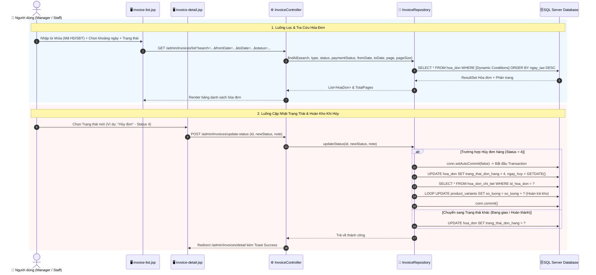
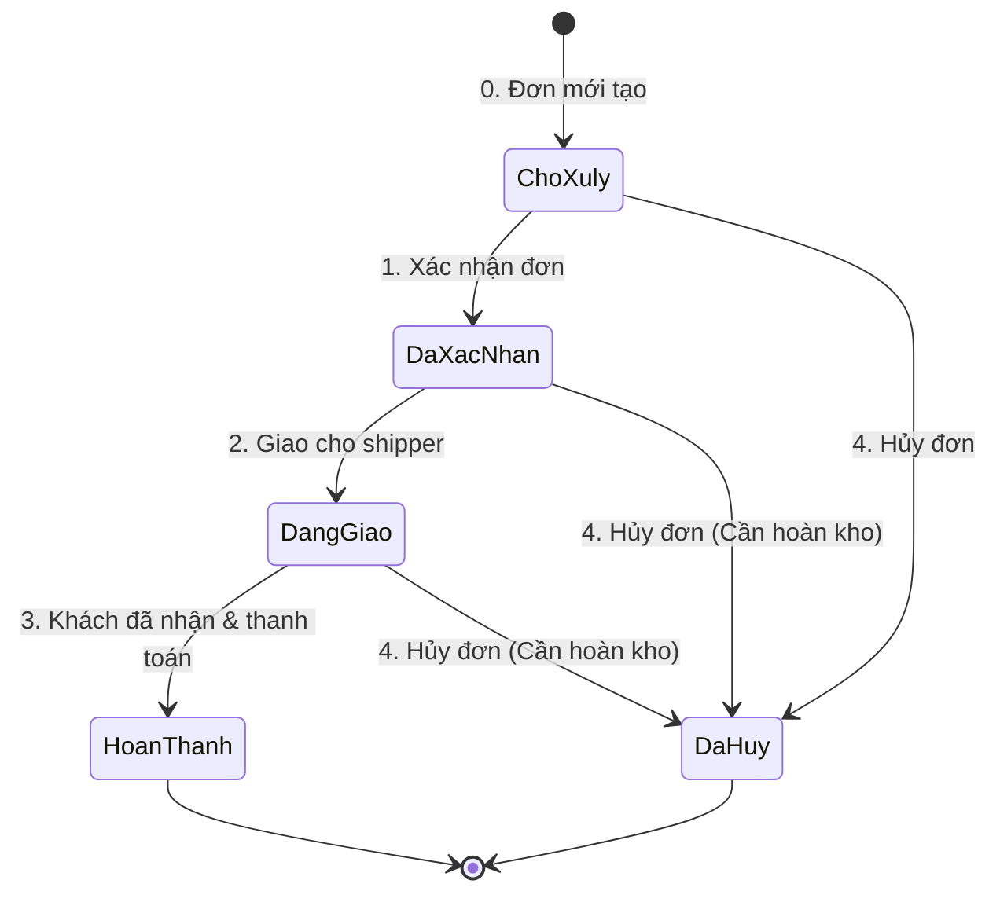

# 🧾 Luồng Hoạt Động: Module Quản Lý Hóa Đơn & Đơn Hàng (Invoices & Orders)

Tài liệu này mô tả chi tiết quy trình tra cứu, quản lý danh sách hóa đơn bán tại quầy và online, luồng chuyển đổi trạng thái đơn hàng, hoàn trả hàng tồn kho khi hủy đơn và xuất báo cáo Excel trong hệ thống FamiCoats.

---

## 1. Thành Phần Code Đảm Nhận

- **Views (JSP):**
  - [invoice-list.jsp](file:///d:/DuAn1-ChayThu/Project1-SD21301/src/main/webapp/WEB-INF/views/admin/phuc/invoice-list.jsp) - Danh sách hóa đơn kèm bộ lọc nâng cao.
  - [invoice-detail.jsp](file:///d:/DuAn1-ChayThu/Project1-SD21301/src/main/webapp/WEB-INF/views/admin/phuc/invoice-detail.jsp) - Màn hình xem chi tiết đơn hàng, lịch sử thay đổi trạng thái và nút cập nhật.
  - [invoice-print.jsp](file:///d:/DuAn1-ChayThu/Project1-SD21301/src/main/webapp/WEB-INF/views/admin/phuc/invoice-print.jsp) - Mẫu in hóa đơn bán lẻ.
- **Controllers / Servlets:**
  - [InvoiceController.java](file:///d:/DuAn1-ChayThu/Project1-SD21301/src/main/java/project/duan1_sd21301/controller/admin/phuc/InvoiceController.java) - Tiếp nhận các request tra cứu, cập nhật trạng thái đơn hàng và xuất Excel.
- **Repositories:**
  - [InvoiceRepository.java](file:///d:/DuAn1-ChayThu/Project1-SD21301/src/main/java/project/duan1_sd21301/repository/phuc/InvoiceRepository.java) - Thực hiện các truy vấn SQL nâng cao (tìm kiếm dynamic, phân trang, thống kê tổng tiền, update trạng thái kèm khôi phục kho).

---

## 2. Sơ Đồ Luồng Hoạt Động (Mermaid Sequence Diagram)

---

## 3. Các Bước Xử Lý Nghiệp Vụ Chi Tiết

### 3.1. Bộ Lọc Tìm Kiếm Đa Chỉ Tiêu
Hệ thống hỗ trợ tìm kiếm linh hoạt thông qua `InvoiceRepository.findAll()` với các tham số:
- **Từ khóa search:** Tìm theo Mã hóa đơn (`HD...`), Tên khách hàng, Số điện thoại nhận.
- **Loại đơn hàng:** Tại quầy (POS) hoặc Đơn Online giao hàng.
- **Trạng thái đơn hàng:** 
  - `0`: Chờ xử lý
  - `1`: Đã xác nhận
  - `2`: Đang giao hàng
  - `3`: Hoàn thành
  - `4`: Đã hủy
- **Khoảng thời gian:** Từ ngày -> Đến ngày (`fromDate`, `toDate`).
- **Phân trang:** Hỗ trợ phân trang chuẩn SQL với `OFFSET` và `FETCH NEXT`.

### 3.2. Vòng Đời Trạng Thái Đơn Hàng (Order Lifecycle)

### 3.3. Cơ Chế Hoàn Trả Tồn Kho Khi Hủy Đơn
Một điểm kỹ thuật quan trọng trong xử lý hóa đơn:
- Khi một đơn hàng đã chốt (đã trừ kho ở bước trước) bị **Hủy (`Status = 4`)**, hệ thống bắt buộc chạy **SQL Transaction** để cộng trả lại số lượng sản phẩm vào kho:
  $$\text{Số lượng tồn kho mới} = \text{Số lượng hiện tại} + \text{Số lượng trong đơn bị hủy}$$
- Nếu mã giảm giá (Coupon) được sử dụng trong đơn đó, lượt sử dụng của Coupon cũng sẽ được giảm đi 1 (`da_su_dung - 1`) để đảm bảo quyền lợi cho cửa hàng.

### 3.4. Xuất Báo Cáo Excel (Apache POI)
- Khi ấn nút **"Xuất Excel"** tại `invoice-list.jsp`, request gửi tới `/admin/invoices/export-excel`.
- `InvoiceController` sử dụng thư viện **Apache POI** để tạo file `.xlsx` động chứa toàn bộ danh sách hóa đơn theo bộ lọc hiện tại, bao gồm: Mã HD, Ngày tạo, Khách hàng, Thu ngân, Phương thức thanh toán, Tổng tiền và Trạng thái.
- File Excel được ghi trực tiếp vào `HttpServletResponse` dưới dạng Attachment Stream để trình duyệt tự động tải xuống.

---

## 4. Phân Quyền Thao Tác

- **Quản lý (Manager):** Có quyền thay đổi mọi trạng thái hóa đơn, duyệt hủy đơn, hoàn tiền và xuất file Excel báo cáo.
- **Nhân viên (Staff):** Xem được danh sách và chi tiết hóa đơn. 
  - Không có quyền bấm nút **Hủy hóa đơn** đã hoàn thành hoặc **Xuất báo cáo Excel** (các nút này bị ẩn trên UI theo quy định an ninh).
