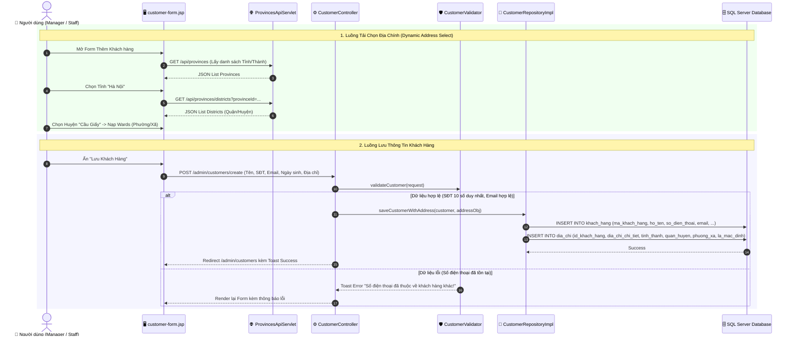

# 👥 Luồng Hoạt Động: Module Quản Lý Khách Hàng & Địa Chính (Customer Management)

Tài liệu này mô tả chi tiết quy trình quản lý thông tin khách hàng, tích hợp API Đơn vị hành chính Việt Nam (Tỉnh/Thành -> Quận/Huyện -> Phường/Xã), quản lý địa chỉ nhận hàng và theo dõi lịch sử mua hàng trong hệ thống FamiCoats.

---

## 1. Thành Phần Code Đảm Nhận

- **Views (JSP):**
  - [customer-list.jsp](file:///d:/DuAn1-ChayThu/Project1-SD21301/src/main/webapp/WEB-INF/views/admin/ha/customer-list.jsp) - Danh sách khách hàng và ô tìm kiếm.
  - [customer-form.jsp](file:///d:/DuAn1-ChayThu/Project1-SD21301/src/main/webapp/WEB-INF/views/admin/ha/customer-form.jsp) - Form Thêm mới / Cập nhật khách hàng tích hợp Selectbox địa chính tự động.
  - [customer-details.jsp](file:///d:/DuAn1-ChayThu/Project1-SD21301/src/main/webapp/WEB-INF/views/admin/ha/customer-details.jsp) - Màn hình hồ sơ khách hàng, danh sách địa chỉ và lịch sử đơn hàng đã mua.
- **Controllers / Servlets:**
  - [CustomerController.java](file:///d:/DuAn1-ChayThu/Project1-SD21301/src/main/java/project/duan1_sd21301/controller/admin/ha/CustomerController.java) - Xử lý điều hướng CRUD khách hàng.
  - [ProvincesApiServlet.java](file:///d:/DuAn1-ChayThu/Project1-SD21301/src/main/java/project/duan1_sd21301/controller/api/ProvincesApiServlet.java) (`/api/provinces/*`) - Proxy API nạp Tỉnh/Thành, Quận/Huyện, Phường/Xã.
  - [AddressApiController.java](file:///d:/DuAn1-ChayThu/Project1-SD21301/src/main/java/project/duan1_sd21301/controller/api/AddressApiController.java) - API thêm/sửa/xóa địa chỉ giao hàng của khách.
- **Validators & Repositories:**
  - [CustomerValidator.java](file:///d:/DuAn1-ChayThu/Project1-SD21301/src/main/java/project/duan1_sd21301/controller/admin/ha/CustomerValidator.java) - Validate định dạng SĐT, Email, Tên khách hàng.
  - `CustomerRepositoryImpl` - Thao tác cơ sở dữ liệu bảng `khach_hang` và `dia_chi`.

---

## 2. Sơ Đồ Luồng Hoạt Động (Mermaid Sequence Diagram)

---

## 3. Các Bước Xử Lý Nghiệp Vụ Chi Tiết

### 3.1. Quản Lý Thông Tin Cốt Lõi Khách Hàng
- Mỗi khách hàng được quản lý theo một **Mã khách hàng duy nhất** (`KHxxxxx`).
- Các trường thông tin cơ bản: Họ tên, Số điện thoại, Email, Giới tính, Ngày sinh, Trạng thái hoạt động.
- **Ràng buộc an toàn (`CustomerValidator`):**
  - Số điện thoại phải tuân theo định dạng chuẩn Việt Nam (10 chữ số, bắt đầu bằng đầu số hợp lệ `03, 05, 07, 08, 09`).
  - Số điện thoại và Email không được trùng lặp với bất kỳ khách hàng nào khác trong cơ sở dữ liệu.

### 3.2. Tích Hợp API Đơn Vị Hành Chính Việt Nam
Để đảm bảo địa chỉ giao hàng chuẩn xác cho các đơn ship online:
- Màn hình `customer-form.jsp` tích hợp 3 ô Selectbox phụ thuộc lẫn nhau: **Tỉnh/Thành phố ➔ Quận/Huyện ➔ Phường/Xã**.
- Khi người dùng chọn Tỉnh/Thành, AJAX tự động gọi `ProvincesApiServlet` lấy về danh sách Quận/Huyện tương ứng và render động vào DOM.
- Địa chỉ hoàn chỉnh được tự động nối thành chuỗi chuẩn: `[Chi tiết], [Phường/Xã], [Quận/Huyện], [Tỉnh/Thành]`.

### 3.3. Xem Lịch Sử Mua Hàng & Hồ Sơ (`customer-details.jsp`)
- Trang chi tiết khách hàng cung cấp góc nhìn toàn diện cho thu ngân/quản lý:
  - Thông tin cá nhân & Danh sách các địa chỉ đã lưu.
  - **Lịch sử đơn hàng đã mua:** Danh sách các hóa đơn tại quầy và online mà khách hàng này đã thực hiện, cùng tổng tiền chi tiêu tích lũy.

---

## 4. Phân Quyền Vai Trò

- **Quản lý (Manager):** Toàn quyền Tạo mới, Chỉnh sửa thông tin khách hàng, Xóa/Khóa khách hàng, Cập nhật địa chỉ.
- **Nhân viên (Staff):** Được phép **Xem danh sách và Chi tiết khách hàng** để phục vụ việc chọn khách hàng khi bán hàng POS. Các chức năng Sửa/Xóa bị vô hiệu hóa.
