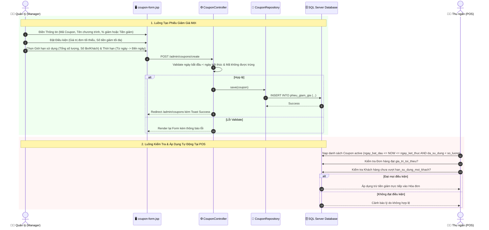

# 🎁 Luồng Hoạt Động: Module Quản Lý Mã Giảm Giá / Khuyến Mãi (Coupons)

Tài liệu này mô tả chi tiết quy trình thiết lập chiến dịch giảm giá, quản lý phiếu giảm giá (% hoặc số tiền cố định), điều kiện đơn hàng tối thiểu, giới hạn lượt dùng và luồng tự động kiểm tra tại POS trong hệ thống FamiCoats.

---

## 1. Thành Phần Code Đảm Nhận

- **Views (JSP):**
  - [coupon-list.jsp](file:///d:/DuAn1-ChayThu/Project1-SD21301/src/main/webapp/WEB-INF/views/admin/phuc/coupon-list.jsp) - Danh sách mã giảm giá, lọc theo trạng thái và thời gian.
  - [coupon-form.jsp](file:///d:/DuAn1-ChayThu/Project1-SD21301/src/main/webapp/WEB-INF/views/admin/phuc/coupon-form.jsp) - Giao diện thiết lập quy tắc mã giảm giá.
- **Controllers / Servlets:**
  - [CouponController.java](file:///d:/DuAn1-ChayThu/Project1-SD21301/src/main/java/project/duan1_sd21301/controller/admin/phuc/CouponController.java) (`/admin/coupons/*`) - Thao tác CRUD mã giảm giá và bật/tắt kích hoạt.
- **Repositories:**
  - [CouponRepository.java](file:///d:/DuAn1-ChayThu/Project1-SD21301/src/main/java/project/duan1_sd21301/repository/phuc/CouponRepository.java) - Xử lý dữ liệu bảng `phieu_giam_gia` và lọc các mã đang hoạt động (`findActive`).

---

## 2. Sơ Đồ Luồng Hoạt Động (Mermaid Sequence Diagram)

---

## 3. Các Bước Xử Lý Nghiệp Vụ Chi Tiết

### 3.1. Phân Loại Loại Hình Giảm Giá
Hệ thống FamiCoats hỗ trợ 2 loại hình giảm giá linh hoạt:
1. **Giảm theo phần trăm (%):** 
   - Ví dụ: Giảm `10%` cho đơn hàng.
   - Đi kèm tham số **Giảm tối đa (`so_tien_giam_toi_da`)** để kiểm soát chi phí (Ví dụ: Giảm 10% tối đa 100.000 VNĐ).
2. **Giảm theo số tiền cố định (VNĐ):**
   - Ví dụ: Trừ trực tiếp `50.000 VNĐ` vào tổng đơn hàng.

### 3.2. Cấu Hình Điều Kiện Áp Dụng
- **Giá trị đơn hàng tối thiểu (`gia_tri_toi_thieu`):** Đơn hàng phải có tạm tính đạt mốc tối thiểu mới được áp mã (Ví dụ: Đơn từ 500.000 VNĐ mới được áp coupon giảm 50k).
- **Tổng số lượng phát hành (`so_luong`):** Giới hạn tổng số lượt sử dụng mã trên toàn hệ thống. Hệ thống tự động ghi nhận số lượt đã dùng (`da_su_dung`).
- **Hạn mức mỗi khách hàng (`han_su_dung_moi_khach`):** Quy định 1 khách hàng chỉ được dùng mã này tối đa $N$ lần.
- **Thời hạn hiệu lực:** Ngày bắt đầu (`ngay_bat_dau`) và Ngày kết thúc (`ngay_ket_thuc`).

### 3.3. Luồng Kiểm Tra Hợp Lệ Nghiệp Vụ
Khi thu ngân chọn mã giảm giá tại màn hình POS hoặc khi thanh toán, hệ thống thực thi 4 bước kiểm tra liên hoàn:
1. $\text{Trạng thái} == 1$ (Đang hoạt động).
2. $\text{Thời gian hiện tại nằm trong khoảng } [\text{Ngày bắt đầu}, \text{Ngày kết thúc}]$.
3. $\text{da\_su\_dung} < \text{so\_luong}$ (Còn lượt trên toàn hệ thống).
4. $\text{Số lượt khách đã dùng} < \text{han\_su\_dung\_moi\_khach}$.

---

## 4. Phân Quyền Vai Trò

- **Quản lý (Manager):** Toàn quyền Tạo mới, Chỉnh sửa, Khóa/Kích hoạt hoặc Xóa phiếu giảm giá.
- **Nhân viên (Staff):** Được phép xem danh sách các mã giảm giá đang hoạt động (`/admin/coupons/list`) để áp dụng cho khách hàng tại quầy POS, nhưng **không có quyền** truy cập trang tạo mới hoặc sửa đổi cấu hình khuyến mãi.
