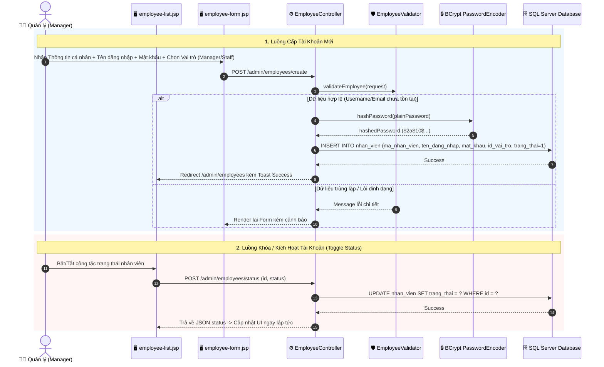

# 👔 Luồng Hoạt Động: Module Quản Lý Nhân Viên & Tài Khoản (Employee Management)

Tài liệu này mô tả chi tiết quy trình cấp tài khoản nhân viên, mã hóa mật khẩu bảo mật, gán vai trò phân quyền (Quản lý vs Nhân viên), vô hiệu hóa tài khoản và bảo vệ an ninh hệ thống FamiCoats.

---

## 1. Thành Phần Code Đảm Nhận

- **Views (JSP):**
  - [employee-list.jsp](file:///d:/DuAn1-ChayThu/Project1-SD21301/src/main/webapp/WEB-INF/views/admin/huy/employee-list.jsp) - Danh sách nhân viên và công tắc Toggle kích hoạt.
  - [employee-form.jsp](file:///d:/DuAn1-ChayThu/Project1-SD21301/src/main/webapp/WEB-INF/views/admin/huy/employee-form.jsp) - Form Thêm mới / Chỉnh sửa tài khoản nhân viên.
  - [employee-detail.jsp](file:///d:/DuAn1-ChayThu/Project1-SD21301/src/main/webapp/WEB-INF/views/admin/huy/employee-detail.jsp) - Hồ sơ thông tin nhân viên & lịch sử ca bán hàng.
- **Controllers / Servlets:**
  - [EmployeeController.java](file:///d:/DuAn1-ChayThu/Project1-SD21301/src/main/java/project/duan1_sd21301/controller/admin/huy/EmployeeController.java) (`/admin/employees/*`) - Xử lý tạo, cập nhật, đổi mật khẩu và toggle trạng thái nhân viên.
- **Validators & Repositories:**
  - [EmployeeValidator.java](file:///d:/DuAn1-ChayThu/Project1-SD21301/src/main/java/project/duan1_sd21301/controller/admin/huy/EmployeeValidator.java) - Kiểm tra trùng tên đăng nhập, email, định dạng số căn cước công dân/SĐT.
  - `EmployeeRepository` - Truy vấn cơ sở dữ liệu bảng `nhan_vien`.

---

## 2. Sơ Đồ Luồng Hoạt Động (Mermaid Sequence Diagram)

---

## 3. Các Bước Xử Lý Nghiệp Vụ Chi Tiết

### 3.1. Cấp Tài Khoản & Mã Hóa Mật Khẩu
1. Quản lý truy cập màn hình thêm nhân viên `/admin/employees/create`.
2. Điền thông tin nhân viên: Mã NV (hoặc tự sinh `NVxxxxx`), Họ tên, Tên đăng nhập (`ten_dang_nhap`), Mật khẩu, Email, SĐT, Căn cước công dân (CCCD), Ngày sinh, Địa chỉ.
3. **Phân quyền vai trò:**
   - **Quản lý (Role ID: 1):** Toàn quyền truy cập mọi tính năng hệ thống.
   - **Nhân viên (Role ID: 2):** Chỉ truy cập bán hàng POS, xem hóa đơn/sản phẩm/khách hàng.
4. Mật khẩu được mã hóa an toàn bằng thuật toán **BCrypt** trước khi ghi vào cơ sở dữ liệu, đảm bảo không lưu plain-text password.

### 3.2. Kiểm Tra Ràng Buộc (`EmployeeValidator`)
- **Tên đăng nhập:** Không chứa ký tự đặc biệt, không được trùng lặp.
- **Email & SĐT:** Phải duy nhất toàn hệ thống.
- **Tuổi tối thiểu:** Nhân viên phải từ 18 tuổi trở lên.

### 3.3. Khóa & Kích Hoạt Tài Khoản (Status Control)
- Quản lý có thể vô hiệu hóa tài khoản của nhân viên đã nghỉ việc bằng công tắc **Status Toggle** (`trang_thai = 0`).
- Tức thì ở lượt thao tác tiếp theo của nhân viên đó:
  - Nếu nhân viên đang đăng nhập, ở request bất kỳ tiếp theo, `AuthFilter` nhận thấy tài khoản đã bị khóa sẽ tự động hủy Session và đẩy ra màn hình Đăng nhập kèm thông báo *"Tài khoản của bạn đã bị vô hiệu hóa!"*.

---

## 4. Bảo Vệ An Ninh Nghiệp Vụ (Strict Security Constraint)

> [!CAUTION]
> **Chức năng Quản lý Nhân viên là vùng an ninh độc quyền dành riêng cho vai trò Quản lý (Manager - ID: 1).**
> 
> - Mọi đường dẫn `/admin/employees/*` đều bị chặn triệt để đối với tài khoản Nhân viên (`roleId == 2`) ở cả 2 cấp độ:
>   1. **UI Level:** Nút menu *"Quản lý Nhân viên"* bị ẩn khỏi thanh Sidebar.
>   2. **AuthFilter Level:** Ngăn chặn ngay lập tức request URL và chuyển hướng về `/admin/pos`.
