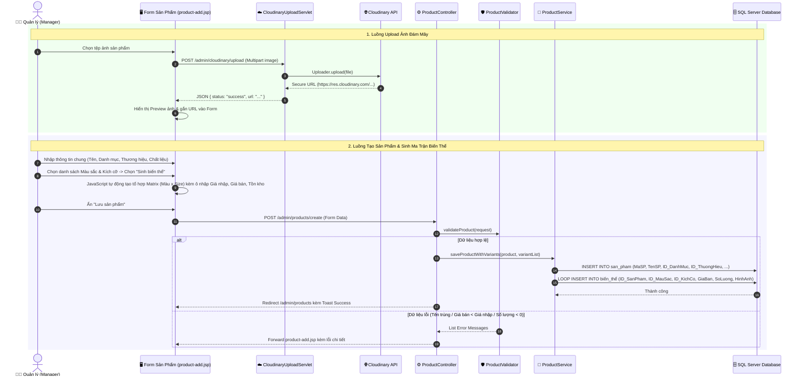

# 📦 Luồng Hoạt Động: Module Quản Lý Sản Phẩm & Biến Thể (Products & Variants)

Tài liệu này mô tả quy trình tạo mới, cập nhật sản phẩm, quản lý ma trận biến thể (Màu sắc x Kích cỡ), lưu trữ hình ảnh đám mây qua Cloudinary API và chuyển đổi trạng thái kinh doanh trong hệ thống FamiCoats.

---

## 1. Thành Phần Code Đảm Nhận

- **Views (JSP):**
  - [product-list.jsp](file:///d:/DuAn1-ChayThu/Project1-SD21301/src/main/webapp/WEB-INF/views/admin/luong/product-list.jsp) - Màn hình danh sách sản phẩm.
  - [product-add.jsp](file:///d:/DuAn1-ChayThu/Project1-SD21301/src/main/webapp/WEB-INF/views/admin/luong/product-add.jsp) - Màn hình tạo mới sản phẩm & sinh biến thể.
  - [product-detail.jsp](file:///d:/DuAn1-ChayThu/Project1-SD21301/src/main/webapp/WEB-INF/views/admin/luong/product-detail.jsp) - Xem chi tiết thông tin sản phẩm và các biến thể.
  - [variant-list.jsp](file:///d:/DuAn1-ChayThu/Project1-SD21301/src/main/webapp/WEB-INF/views/admin/luong/variant-list.jsp) - Quản lý danh sách toàn bộ biến thể độc lập.
- **Controllers / Servlets:**
  - [ProductController.java](file:///d:/DuAn1-ChayThu/Project1-SD21301/src/main/java/project/duan1_sd21301/controller/admin/luong/ProductController.java) - Điều hướng và xử lý CRUD sản phẩm.
  - [VariantController.java](file:///d:/DuAn1-ChayThu/Project1-SD21301/src/main/java/project/duan1_sd21301/controller/admin/luong/VariantController.java) - Điều hướng và xử lý biến thể.
  - [CloudinaryUploadServlet.java](file:///d:/DuAn1-ChayThu/Project1-SD21301/src/main/java/project/duan1_sd21301/controller/admin/luong/CloudinaryUploadServlet.java) (`/admin/cloudinary/upload`) - API upload ảnh trực tiếp lên Cloudinary.
- **Validators & Services:**
  - [ProductValidator.java](file:///d:/DuAn1-ChayThu/Project1-SD21301/src/main/java/project/duan1_sd21301/controller/admin/luong/ProductValidator.java) - Kiểm tra tính hợp lệ dữ liệu sản phẩm & biến thể.
  - `ProductService`, `ProductServiceImpl` - Tầng nghiệp vụ quản lý sản phẩm.

---

## 2. Sơ Đồ Luồng Hoạt Động (Mermaid Sequence Diagram)

---

## 3. Các Bước Xử Lý Nghiệp Vụ Chi Tiết

### 3.1. Tạo Sản Phẩm & Ma Trận Biến Thể
1. Quản lý nhập thông tin tổng quan của áo khoác: Tên sản phẩm, Mã sản phẩm (hoặc tự sinh), Danh mục (Áo gió, Áo dạ, Áo phao...), Thương hiệu, Chất liệu, Kiểu dáng.
2. Tại phần Thuộc tính biến thể, người dùng tick chọn các Màu sắc (Đen, Trắng, Đỏ...) và Kích cỡ (S, M, L, XL...).
3. Script trên giao diện JavaScript tích hợp sẵn sẽ nhân ma trận tổ hợp:
   $$\text{Tổng số biến thể} = \text{Số màu sắc} \times \text{Số kích cỡ}$$
4. Mỗi dòng biến thể cho phép cài đặt riêng: **Mã SKU**, **Giá nhập**, **Giá bán**, **Số lượng tồn kho ban đầu** và **Ảnh riêng của màu đó**.

### 3.2. Lưu Trữ Hình Ảnh Qua Cloudinary API
- Khi người dùng tải ảnh lên ở bất cứ vị trí nào (ảnh đại diện sản phẩm hay ảnh biến thể), giao diện sử dụng Fetch API gửi request tới `CloudinaryUploadServlet`.
- Servlet tiếp nhận file stream, gọi SDK Cloudinary đẩy tệp lên đám mây và nhận về URL HTTPS cố định.
- URL này được lưu trực tiếp vào cơ sở dữ liệu (cột `hinh_anh`), giúp giảm tải lưu trữ cho Server ứng dụng và tối ưu tốc độ tải trang.

### 3.3. Kiểm Tra Dữ Liệu (`ProductValidator`)
Trước khi ghi dữ liệu vào DB, `ProductValidator` thực thi các quy tắc nghiêm ngặt:
- **Tên sản phẩm:** Không được trùng với sản phẩm đã tồn tại trong DB.
- **Giá bán & Giá nhập:** Giá bán phải lớn hơn hoặc bằng Giá nhập, không được âm.
- **Số lượng tồn:** Phải là số nguyên lớn hơn hoặc bằng 0.
- **Mã biến thể / SKU:** Phải là duy nhất toàn hệ thống.

### 3.4. Bật / Tắt Trạng Thái Kinh Doanh (Toggle Switch)
- Tại bảng danh sách `product-list.jsp`, mỗi sản phẩm có nút công tắc **Toggle Switch (Còn hàng / Ngừng kinh doanh)**.
- Khi người dùng bật/tắt, AJAX gửi request về `/admin/products/toggle?id=...`.
- Hệ thống cập nhật trường `trang_thai` trong DB (1: Kích hoạt, 0: Vô hiệu hóa). 
- Khi sản phẩm bị tắt trạng thái, toàn bộ các biến thể của sản phẩm đó tự động bị ẩn khỏi Màn hình bán hàng POS.

---

## 4. Phân Quyền Vai Trò (Role Guard)

- **Quản lý (ID: 1):** Toàn quyền Xem, Thêm mới sản phẩm, Chỉnh sửa thông tin, Xóa/Bật tắt trạng thái, Quản lý biến thể.
- **Nhân viên (ID: 2):** Chỉ được phép **Xem danh sách sản phẩm** để tra cứu thông tin tư vấn khách hàng.
  - Các nút *"Thêm mới sản phẩm"*, *"Chỉnh sửa"*, *"Xóa"* và công tắc *"Toggle Status"* bị **ẩn hoàn toàn trên UI**.
  - Nếu Nhân viên nhập trực tiếp URL thêm/sửa sản phẩm, `AuthFilter` sẽ chặn và báo lỗi 403.
