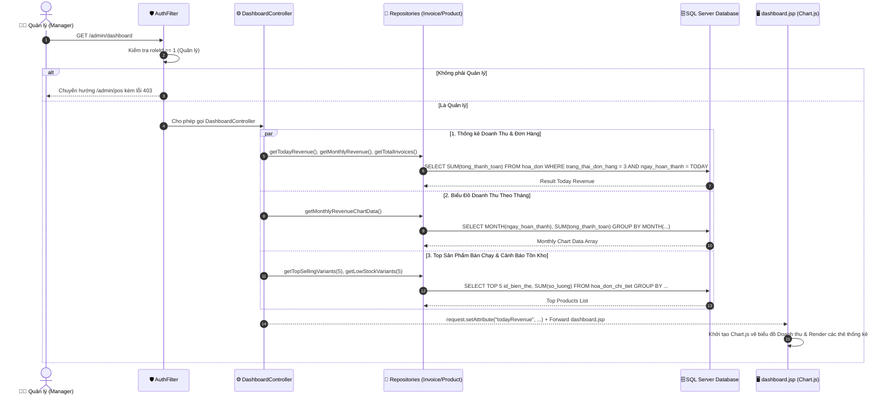

# 📊 Luồng Hoạt Động: Module Bảng Điều Khiển & Thống Kê (Dashboard & Analytics)

Tài liệu này mô tả chi tiết quy trình tổng hợp chỉ số kinh doanh, thống kê doanh thu, biểu đồ phân tích đơn hàng, danh sách sản phẩm bán chạy và cảnh báo tồn kho dành cho Quản lý trong hệ thống FamiCoats.

---

## 1. Thành Phần Code Đảm Nhận

- **Views (JSP):**
  - [dashboard.jsp](file:///d:/DuAn1-ChayThu/Project1-SD21301/src/main/webapp/WEB-INF/views/admin/dashboard.jsp) - Bảng điều khiển phân tích chi tiết doanh thu, biểu đồ Chart.js, thống kê top sản phẩm.
  - [home.jsp](file:///d:/DuAn1-ChayThu/Project1-SD21301/src/main/webapp/WEB-INF/views/admin/home.jsp) - Trang điều hướng tổng quan hệ thống.
- **Controllers / Servlets:**
  - [DashboardController.java](file:///d:/DuAn1-ChayThu/Project1-SD21301/src/main/java/project/duan1_sd21301/controller/admin/DashboardController.java) (`/admin/dashboard`) - Tiếp nhận truy vấn tổng hợp báo cáo kinh doanh theo mốc thời gian.
  - [HomeController.java](file:///d:/DuAn1-ChayThu/Project1-SD21301/src/main/java/project/duan1_sd21301/controller/admin/HomeController.java) (`/admin/home`) - Chuyển hướng trang chủ quản trị.
- **Repositories & Database:**
  - `InvoiceRepository`, `ProductRepository`, `CustomerRepository` - Tổng hợp dữ liệu từ SQL Server qua các câu lệnh SQL Aggregate Functions (`SUM`, `COUNT`, `GROUP BY`, `TOP N`).

---

## 2. Sơ Đồ Luồng Hoạt Động (Mermaid Sequence Diagram)

---

## 4. Phân Tích Các Chỉ Số Cốt Lõi Trên Dashboard

1. **Thẻ Chỉ Số Doanh Thu (Revenue Cards):**
   - **Doanh thu Hôm nay:** Tổng giá trị các hóa đơn hoàn thành trong ngày.
   - **Doanh thu Tháng này:** Tổng doanh thu tích lũy trong tháng hiện tại.
   - **Tổng số Đơn hàng:** Số lượng hóa đơn được xử lý thành công.
   - **Khách hàng mới:** Số lượng khách hàng đăng ký mới trong tháng.
2. **Biểu Đồ Doanh Thu & Đơn Hàng (Chart.js):**
   - Trực quan hóa biến động doanh thu theo các ngày trong tháng hoặc theo các tháng trong năm dưới dạng Biểu đồ đường (Line Chart) hoặc Biểu đồ cột (Bar Chart).
3. **Top Sản Phẩm Bán Chạy (Top Selling Products):**
   - Liệt kê 5 biến thể áo khoác có số lượng bán ra cao nhất, hỗ trợ quản lý đưa ra quyết định nhập hàng kịp thời.
4. **Cảnh Báo Sản Phẩm Sắp Hết Hàng (Low Stock Alert):**
   - Danh sách các biến thể có số lượng tồn kho $\le 5$, giúp cửa hàng chủ động bổ sung hàng vào kho.

---

## 5. Quyền Truy Cấp An Ninh

- **Quản lý (Manager - ID: 1):** Quyền xem duy nhất.
- **Nhân viên (Staff - ID: 2):** **Bị chặn tuyệt đối.** Mọi nỗ lực truy cập `/admin/dashboard` đều bị `AuthFilter` ngăn chặn nhằm bảo mật dữ liệu doanh số kinh doanh của cửa hàng.
